...

### Docker Contribs

[ClamAV-Alpine](https://github.com/tquizzle/clamav-alpine)

<picture>
  

</picture>

[Ghost-Docker](https://github.com/tquizzle/ghost-docker)

<picture>
  

</picture>

 
<picture>
  

</picture>

<picture>
  

</picture>
